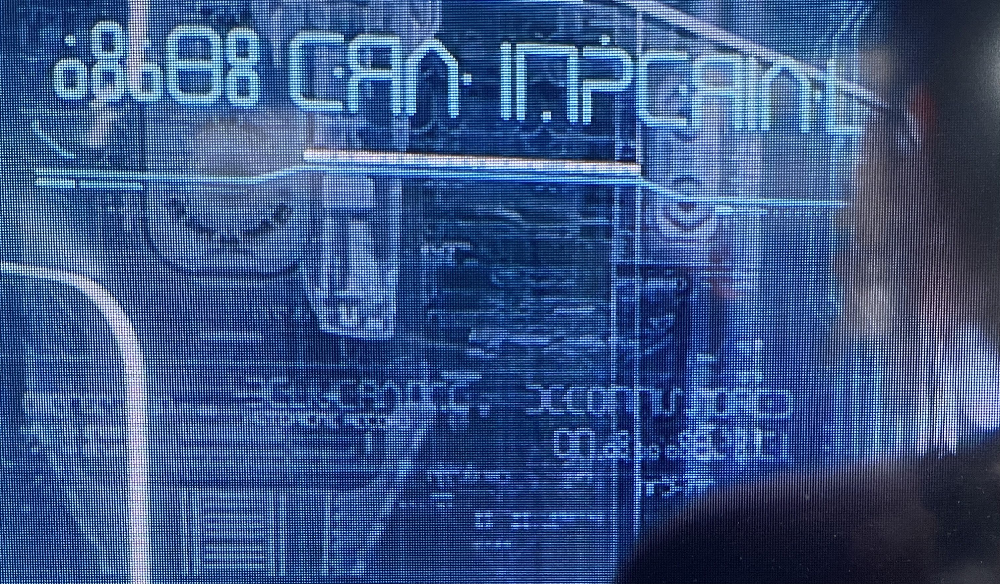

# Foundation Screen

The type design used on screens shown in the Apple TV+ series Foundation.

This is one in a series of related fonts based on type designs used on Foundation, including <a href="https://github.com/rsperberg/foundation-logo" title="Jump to Foundation Logo repo">Foundation Logo</a>, <a href="https://github.com/rsperberg/foundation-titles-hand" title="Jump to Foundation Titles repo">Foundation Titles</a>, <a href="https://github.com/rsperberg/foundation-one" title="Jump to Foundation One repo">Foundation One</a> and the not-yet-begun <a href="https://github.com/rsperberg/foundation-serif" title="Jump to Foundation Serif repo">Foundation Serif</a>.  All use the SIL Open Font License and are hosted here on GitHub.
